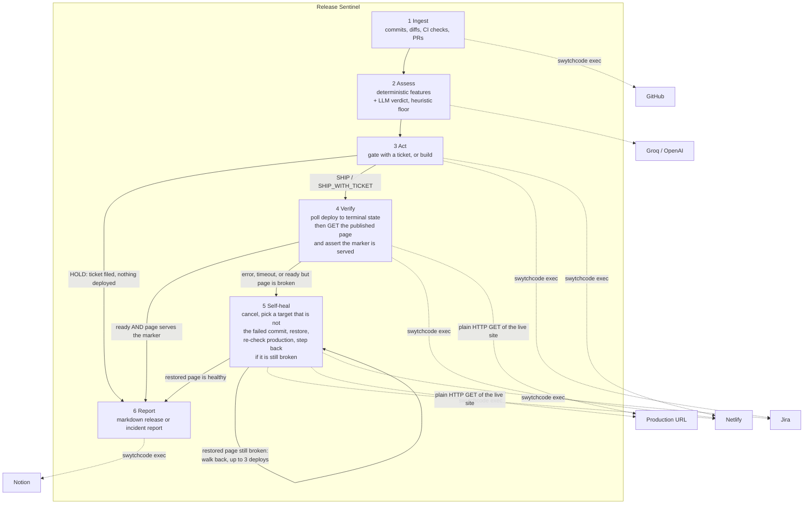
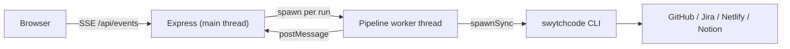

# Release Sentinel

An autonomous release agent. It reads GitHub activity, scores how risky the change
is, decides whether to ship it, triggers the deploy, then fetches the published
page to check the release actually works — and when a deploy fails or publishes a
broken site, it rolls production back, confirms the good page is being served
again, files a Jira incident and writes a postmortem to Notion.

Every external action is executed through **Swytchcode**. There is no hand-written
HTTP client and no vendor SDK anywhere in this codebase.

Built for the Build with Swytchcode Buildathon, **Track 3 — AI DevOps & Deployment Agent**.

---

## Why this is an agent, not a webhook

A bot that files a ticket when CI goes red is a cron job with extra steps. Release
Sentinel is a closed loop with a real decision in the middle and real recovery at
the end:

- It **decides**. The LLM returns a structured verdict (`SHIP`, `SHIP_WITH_TICKET`,
  `HOLD`) with a risk score and a written rationale, reasoning over extracted
  evidence rather than raw diffs.
- It **acts** on that decision, and the control flow genuinely diverges: a `HOLD`
  never reaches the deploy step.
- It **verifies** its own work twice over: it polls the deploy to a terminal state,
  then fetches the published page and asserts it actually serves the content it
  should. A green build that ships a broken page does not pass.
- It **recovers** without being asked — cancel, roll back, file the incident, write
  the postmortem.

The agent guards the repository it lives in, so the demo is self-contained.

---

## Architecture



The only HTTP request the agent makes itself is the health check GET of its own
public site — reading a page anyone can read. Every action against GitHub, Jira,
Netlify and Notion goes through a Swytchcode canonical ID.

Data flows between stages rather than each stage acting independently: the commit
SHA drives the risk verdict, the verdict decides whether a Jira ticket is filed and
whether a deploy happens, the deploy id drives verification, and the rollback
target plus the incident key both land in the Notion report.

### Process model



`@swytchcode/runtime`'s `exec()` is built on `spawnSync`, which blocks the Node
event loop for the entire duration of the subprocess and its HTTP call. Running the
pipeline on the main thread would freeze the server and stall the SSE stream for
tens of seconds per run, so the dashboard would replay the whole timeline at the end
instead of live. The pipeline therefore runs in a worker thread and streams progress
back over `postMessage`.

### Layout

| Path | Role |
| --- | --- |
| `src/swytch.ts` | The only module that calls Swytchcode. Retry policy, error classification and the per-run audit trail live here. |
| `src/integrations/` | One thin module per service, mapping domain operations to canonical IDs. |
| `src/agent/features.ts` | Deterministic risk feature extraction and the heuristic score. |
| `src/agent/risk.ts` | LLM verdict under a strict JSON schema, reconciled against the heuristic. |
| `src/steps/` | One module per pipeline stage. |
| `src/pipeline.ts` | The state machine wiring the stages together. |
| `src/worker.ts` | Runs one pass off the main thread. |
| `src/server.ts` | HTTP API and SSE fan-out. |
| `public/` | Live dashboard. |
| `site/`, `scripts/build-site.mjs` | The static site Netlify builds, and the build that fails authentically. |

---

## Swytchcode usage

27 methods across 4 integrations are enabled in `tooling.json` (`swytchcode list
tooling`). Sixteen of them are called by the agent; the rest were enabled while
exploring the bundles and are left in place. The ones on the hot path:

| Canonical ID | Used for |
| --- | --- |
| `github.commit.get.1` | List commits on the branch since the lookback window |
| `github.commit.get.2` | Per-commit diff stats and changed files |
| `github.commit.checkRuns.get` | CI check runs for the candidate commit |
| `github.commit.status.get` | Combined commit status |
| `github.commit.pulls.get` | Pull requests associated with a commit |
| `netlify.site.get` | Resolve site name and URL |
| `netlify.build.create` | Trigger a real git-linked production build |
| `netlify.deploy.get` | List deploys, to find the rollback target |
| `netlify.deploy.get.1` | Poll a specific deploy's state |
| `netlify.cancel.create` | Cancel a stalled deploy |
| `netlify.deploy.restore.create` | **Roll production back to a known good deploy** |
| `jira.api.issue.create` | File the review ticket and the incident |
| `jira.api.comment.create` | Annotate an existing issue |
| `jira.api.issueLink.create` | Link the incident to the review ticket |
| `notion.markdown.update` | Append the release or incident report as Markdown |
| `notion.me.list` | Verify the Notion token during preflight |

### Notes from integrating against the live registry

Things worth recording, because they shaped the design:

1. **`github.commit.list` is the commit *search* endpoint**, not "list a repo's
   commits". Search is served from an index that lags pushes by seconds to minutes,
   which is unusable when the whole point is reacting to a commit that just landed.
   The direct endpoint is `github.commit.get.1`.
2. **Most of the Notion bundle cannot be enabled.** `notion.page.create`,
   `notion.children.update`, `notion.search.create`, `notion.block.update`,
   `notion.query.create` and others fail on `resolve STRUCTs in RETURNS: struct
   "api.page.createResponse200" not found in STRUCTS`. `notion.markdown.update`
   does work, and appending Markdown is a better fit for release notes than
   assembling blocks — but the agent can only append to a page you create, not
   create pages itself.
3. **The Notion fallback was deleted on purpose.** `notion.comment.create` looked
   like a safety net for the report, but the bundle does not declare a
   `Notion-Version` input for it, so Notion rejected every call with
   `missing_version`. That was worse than having no fallback: the real error —
   almost always a page that has not been connected to the integration — was
   replaced by a misleading one, and debugging chased the wrong header for an
   hour. There is now exactly one report path and the first failure surfaces
   verbatim. Related: `insert_content.position` must be an object
   (`{ "type": "end" }`); the string `"end"` is rejected with
   `body.insert_content.position should be an object or undefined`.
4. **A repo with no CI is not a repo with CI in progress.** GitHub's combined
   status endpoint answers `pending` for a commit that has zero statuses, which
   is indistinguishable from "the build is still running" unless you also read
   `total_count`. Feeding that straight to the model was a real bug: it correctly
   treats pending CI as a strong negative signal, so a one-line HTML change came
   back at 70/100 and was held, and scores for equivalent changes swung between
   10 and 85. `src/integrations/github.ts` now reports `combinedCheckState:
   "none"` when there are no check runs *and* no statuses, and the system prompt
   in `src/agent/risk.ts` tells the model that `none` is a constant property of
   the repository rather than evidence about this change. Verdicts became stable
   immediately.
5. **Jira's bundle ships a placeholder base URL** (`https://your-domain.atlassian.net`).
   Swytchcode resolves base URLs from `.swytchcode/integrations/manifest.json`, so
   `npm run preflight` rewrites that one field from `JIRA_BASE_URL`. Jira Cloud also
   needs Basic auth (email + API token) rather than the bearer placeholder, and REST
   v3 requires Atlassian Document Format for text fields — both handled in
   `src/integrations/jira.ts`.

Inputs are strictly type-validated by the kernel, so integers must be passed as JSON
numbers. This is why the agent uses the runtime library rather than shelling out with
string CLI flags.

---

## Setup

From nothing to a working agent, in order. Requires Node 20 or newer
(`package.json` sets `engines.node >= 20`).

**1. Install the toolchain.**

```bash
npm i -g swytchcode
swytchcode login          # opens a browser; run `swytchcode whoami` to confirm
git clone <this repo> && cd release-sentinel
npm install
```

**2. Fetch the four integration bundles.** Project names are **case-sensitive** —
`swytchcode get github` does not fetch anything useful, `swytchcode get GitHub`
does:

```bash
swytchcode get GitHub
swytchcode get Jira
swytchcode get Netlify
swytchcode get Notion
```

`swytchcode list tooling` shows what ended up enabled.

**3. Create the accounts and artifacts.**

| Service | What you need | Notes |
| --- | --- | --- |
| GitHub | Fine-grained PAT with read access | On a repo you can push to live |
| Netlify | **Full-access** PAT + a site **linked to that repo** | A read-only token passes every read and 401s on every write |
| Jira | Free Cloud site, a project, an API token | Note the project key; auth is Basic (email + token), not bearer |
| Notion | Internal integration token + a page **connected to the integration** | `...` menu → Connections → Connect to → pick your integration |
| Groq or OpenAI | API key | Without it the agent falls back to heuristics and flags the verdict as degraded |

Only Notion's page and Netlify's site need manual clicking; everything else is a
token paste. Both of those clicks are load-bearing — see
[Troubleshooting](#troubleshooting).

**4. Configure the environment.**

```bash
cp .env.example .env    # PowerShell: Copy-Item .env.example .env
```

**5. Run preflight.**

```bash
npm run preflight
```

Preflight does two jobs. It rewrites the Jira `production_endpoint` in the
Swytchcode manifest from the placeholder the bundle ships to your real
`JIRA_BASE_URL` — **Jira calls fail until this has been run at least once** — and
then makes one real call per service so a bad token surfaces now rather than
mid-demo. It creates a throwaway Jira ticket labelled `preflight` and appends a
line to the Notion page; delete them afterwards.

### Environment variables

| Variable | Default | What it does |
| --- | --- | --- |
| `GITHUB_TOKEN` | — | Fine-grained PAT, read access to the repo |
| `GITHUB_OWNER` / `GITHUB_REPO` | — | The repository the agent guards |
| `GITHUB_BRANCH` | `main` | Branch treated as the release branch |
| `GROQ_API_KEY` | — | Model key. Groq is free and OpenAI-compatible |
| `OPENAI_API_KEY` | — | Alternative to `GROQ_API_KEY` |
| `LLM_MODEL` | `openai/gpt-oss-20b` (Groq), `gpt-4o-mini` (OpenAI) | Strict JSON schemas are only guaranteed on `openai/gpt-oss-*` |
| `LLM_BASE_URL` | Groq's URL when `GROQ_API_KEY` is set | Only needed for a custom provider |
| `NETLIFY_TOKEN` | — | **Full access** PAT; the agent writes |
| `NETLIFY_SITE_ID` | — | Site configuration → General → Site ID |
| `JIRA_BASE_URL` | — | Site root, no trailing slash |
| `JIRA_EMAIL` / `JIRA_API_TOKEN` | — | Combined into a Basic auth header |
| `JIRA_PROJECT_KEY` | — | e.g. `KAN` |
| `JIRA_ISSUE_TYPE` | `Task` | Issue type used for tickets and incidents |
| `JIRA_USE_ADF` | `true` | REST v3 wants Atlassian Document Format |
| `NOTION_TOKEN` | — | Internal integration token |
| `NOTION_REPORT_PAGE_ID` | — | 32-hex id from the page URL |
| `NOTION_VERSION` | `2026-03-11` | The Markdown content API needs a recent version |
| `RISK_THRESHOLD` | `65` | Score at or above which the agent refuses to ship |
| `LOOKBACK_MINUTES` | `120` | Only commits this recent count as a candidate |
| `MAX_COMMITS` | `10` | **Set to `1` for demos** — see Troubleshooting |
| `DEPLOY_TIMEOUT_MS` | `300000` | An unsettled deploy is treated as a failure |
| `DEPLOY_POLL_INTERVAL_MS` | `6000` | Deploy state poll interval |
| `HEALTH_CHECK_ENABLED` | `true` | When `false`, a `ready` deploy is trusted without fetching the site |
| `HEALTH_CHECK_MARKER` | `Guarded by Release Sentinel` | Text that must appear in the served HTML |
| `HEALTH_CHECK_ATTEMPTS` | `4` | Attempts before the site is declared unhealthy |
| `HEALTH_CHECK_RETRY_DELAY_MS` | `4000` | Pause between attempts, for CDN propagation |
| `HEALTH_CHECK_TIMEOUT_MS` | `10000` | Per-request timeout |
| `HEALTH_CHECK_URL` | deploy's own URL | Override to check a fixed URL instead |
| `AGENT_DRY_RUN` | `false` | Reason and report, deploy nothing |
| `PORT` | `3000` | Dashboard port |

---

## Running

| Script | What it does |
| --- | --- |
| `npm run dev` | Dashboard on `http://localhost:3000`, restarting on file changes |
| `npm start` | Same dashboard, no watcher |
| `npm run run:once` | One headless pass. Exits non-zero if the release was not healthy — this is the CI-friendly entry point. **Triggers a real deploy.** |
| `npm run preflight` | Rewrites the Jira endpoint and probes every service. **Creates a real Jira ticket each time.** |
| `npm run selftest` | Drives every branch of the state machine against a stubbed kernel. No credentials, no network. |
| `npm run typecheck` | `tsc --noEmit` |
| `npm run build:site` | The build command Netlify runs; useful for reproducing a build failure locally |

`npm run selftest` matters more than it looks. You cannot rehearse a rollback on
demand against a live site without deliberately breaking production, so the branch
that matters most would otherwise be the least tested. It scripts a deploy failure
and asserts the agent cancels, restores the previous deploy and files the incident —
in both flavours: a build that fails, and a build that succeeds while publishing a
broken page. It also covers gating by failing check, gating by threshold, the
ship-with-ticket middle path, and the clean ship:

```
PASS low-risk change ships and is reported
PASS failing CI check is gated before any deploy
PASS failed deploy triggers rollback and an incident
PASS healthy deploy state but a broken page triggers rollback
PASS risky dependency bump ships with a follow-up review ticket
PASS the same change is blocked once the risk threshold is tightened
```

The dashboard streams the agent loop live: each stage's status, the risk gauge and
rationale, the ingested commits, links to every artifact the agent created, and a
table of every `swytchcode exec` with its duration and retry count.

Set `AGENT_DRY_RUN=true` to reason and report without deploying — worth doing once
before pointing it at anything you care about.

---

## Demo script

Set `MAX_COMMITS=1` first, so only the head commit is assessed. Otherwise a
backlog of unrelated commits inflates the score and muddies the narration.

**1. Safe ship.** Push a small, safe commit — a line of copy in the README, or a
CSS colour. Sentinel ingests it, scores it low, ships it, watches the deploy
reach `ready`, fetches the published page and confirms it still serves the
marker, then appends a release report to Notion. Narrate the risk gauge: the
agent explains *why* it is shipping.

**2. Held risky change.** To show the gate without touching CI, either lower
`RISK_THRESHOLD` or push a commit that touches `package.json` with `hotfix` in
the message. The verdict comes back `HOLD`, a blocking Jira ticket is filed with
the full rationale, concerns and commit list, labelled `release-sentinel` and
`deploy-blocked` — and the deploy step never runs. Open the ticket; it reads like
something a human wrote.

**3. Green build, broken page — the rollback (the one worth demoing).** A build can exit zero and
still publish something broken, and that is the failure a deploy-state poll can
never see. Push a commit whose only change is this one line in `site/index.html`:

```diff
-      <h1>Guarded by Release Sentinel</h1>
+      <h1>TODO: new headline</h1>
```

`scripts/build-site.mjs` succeeds — nothing is missing, the HTML is valid — so
Netlify publishes the deploy and reports `ready`. Then Sentinel fetches the live
URL, does not find `HEALTH_CHECK_MARKER` in the page, retries four times for CDN
propagation, gives up, and treats the release exactly like a failed deploy: it
picks a rollback target that was **not** built from the failed commit, restores
it, fetches production again to prove the good page is back, files a Jira
incident saying the page was published without the expected content, and writes
the postmortem. The audience watches production break and un-break itself, and
the log line to point at is `production verified healthy after rollback`.

Undo it with `git checkout site/index.html` (or push the revert) once the rollback
has been shown. If you legitimately reword that heading, change
`HEALTH_CHECK_MARKER` in `.env` to match.

**Also supported — broken build.** Push a commit that renames `site/site.css`
without updating `index.html`. `scripts/build-site.mjs` exits non-zero, Netlify
reports the deploy as `error`, and Sentinel cancels it, restores the previous
deploy, files the incident and reports. Netlify never publishes this build, so
production never visibly changes — which is exactly why path 3 makes the better
demo.

Rehearse the failure path before demoing it, and force the failure with a change you
have already tested rather than improvising one on stage. If the network is
unreliable on the day, `npm run selftest` proves all of the above offline in nine
seconds.

---

## Design decisions

**An explicit state machine, not a free-roaming LLM.** The model makes exactly one
decision — how risky this change is and what to do about it — and the pipeline in
`src/pipeline.ts` decides everything else. Nothing in the loop lets a model choose
to call `netlify.deploy.restore.create`. That is deliberate: this agent has
production write access to four systems, and the failure mode of a tool-choosing
agent is an unbounded set of actions taken for a plausible-sounding reason. The
control flow still genuinely diverges — a `HOLD` never reaches the deploy step, an
unhealthy site diverts into recovery — but every edge is written down, reviewable,
and testable. `npm run selftest` can enumerate the branches precisely because
there is a finite set of them.

**Deterministic features, LLM judgement.** Feeding raw diffs to a model is expensive
and irreproducible. `features.ts` extracts evidence (churn, whether dependency
manifests or CI config or migrations were touched, failing check counts, urgency
keywords) and the model reasons over that. It keeps token usage bounded, keeps a
1,000-line vendored dependency from crowding out the signal, gives the heuristic
fallback exactly the same inputs, and makes the prompt small enough to read — so
when a verdict is wrong you can see which feature caused it. The `combinedCheckState:
"none"` fix came out of exactly that.

**The model cannot overrule hard evidence.** A verdict is reconciled against the
heuristic score: a failing CI check forces `HOLD` regardless of what the model said,
and the heuristic acts as a floor on the score, never a ceiling. The floor exists
because the model is the component most likely to be confidently wrong and the
least likely to be reproducibly wrong; the heuristic is dumb but it cannot be
argued with. The model can always make a release *more* cautious than the
heuristic — it just cannot talk the agent into shipping over a failing check.

**A real build, not a digest upload.** Deploys are triggered with
`netlify.build.create`, which builds the linked repository, rather than the
file-digest deploy API which uploads prebuilt files. A digest upload of files that
are already on disk essentially always succeeds, so there would be nothing to
self-heal from — the recovery path would be unreachable in a live demo and
untestable in reality. Building from git means broken code produces a genuine
`error` state, and it also means Netlify's own CD builds the same commit, which is
what exposed the rollback bug below.

**Degrade rather than abort.** Reads retry only when the kernel marks the failure
retryable; writes never retry, because a duplicate Jira ticket is worse than a failed
one. A missing Notion token costs the report, not the rollback.

**A timeout is a failure.** An unfinished deploy is not a safe state to leave
production in, so it triggers recovery rather than an indefinite wait.

**A green build is not a healthy release.** This is the decision the rest of the
agent is built around. Netlify never publishes a build that exits non-zero, so
polling the deploy state can only ever catch build failures — and a build failure
is the one kind of bad release that never reaches a user. The failure that
actually hurts is a green build serving a broken page. So after the deploy
publishes, the agent fetches the deployed URL itself and requires a 2xx response
whose body contains `HEALTH_CHECK_MARKER`, retrying up to
`HEALTH_CHECK_ATTEMPTS` times for CDN propagation. Anything else is treated
identically to a failed deploy. Without this check the agent would have reported
"shipped" on a site nobody could use.

**Rollback has to be verified, not assumed.** This one was a genuine bug, found by
rehearsing the demo rather than by reading the code. `lastGoodDeploy` originally
picked the newest deploy in state `ready`. But a broken page is also `ready` — and
because the site is git-linked, Netlify's own CD had built the same commit the
agent built, so the deploy list contained a *second* `ready` deploy of the very
commit that had just failed its health check. The agent dutifully restored it and
republished the same broken site, then reported a successful rollback. Two fixes,
both in `src/integrations/netlify.ts` and `src/steps/heal.ts`: skip every deploy
whose `commitRef` matches the failed commit, and re-run the health check *after*
restoring, walking back up to three deploys until production actually serves a
good page. If it never does, the incident says so instead of claiming a recovery
that did not happen.

---

## Troubleshooting

Every one of these cost real time during the build, and none of them announce
themselves clearly.

**`swytchcode get` is case-sensitive.** `swytchcode get GitHub` works;
`swytchcode get github` does not, and does not obviously complain. Same for
`Jira`, `Netlify`, `Notion`.

**Jira 404s or hits `your-domain.atlassian.net`.** The Jira bundle ships a
placeholder base URL in the Swytchcode manifest. `npm run preflight` patches it
from `JIRA_BASE_URL`; until you have run preflight at least once, nothing Jira
works.

**Every Netlify write returns 401 while every read succeeds.** The token is
read-only. Netlify PATs can be scoped, and a read-only one sails through
`netlify.site.get` and `netlify.deploy.get` and then 401s on
`netlify.build.create` and `netlify.deploy.restore.create` — which reads exactly
like a wiring bug and is not one. Issue a **full access** token.

**Every Notion call 404s despite a valid token and the right page id.** The page
has not been connected to the integration. Open the page, `...` → **Connections**
→ **Connect to** → pick your integration. Notion returns 404, not 403, for a page
the integration cannot see. Also: the page id is the 32-hex segment of the URL,
and for a subpage it is the `?p=` query parameter, not the path segment — copying
the path of a nested page gives you the parent's id and the same 404.

**Some Jira methods cannot be enabled at all.** `jira.api.search.list5` and
`jira.api.recent.list` fail with an unresolved `StringList` struct.
`jira.api.project.list7` works and is enough for project discovery.

**Risk scores jump around between similar commits.** Almost certainly
`MAX_COMMITS`. The default of `10` means a backlog of unrelated commits is
assessed as one release candidate, so the score reflects the backlog rather than
the change you just pushed. Set `MAX_COMMITS=1` for demos. (The other historical
cause was the `pending` vs `none` combined-status bug, fixed above.)

**`.env` changes appear to do nothing.** The dashboard reads config at startup.
Restart the server after editing `.env`.

---

## Proven live

Everything below is from real runs against `SahilSumrani/agents_knotic` and the
Netlify site `agentneww` (<https://agentneww.netlify.app>). No mocks.

**`run 6db3f14b` — the healthy path.** Outcome `shipped`. Risk 10/100, action
`SHIP`. Real Netlify build, deploy reached `ready`, post-deploy health check
passed against the live URL, release report appended to Notion. 9 Swytchcode
calls.

**`run c6348cc3` — the self-heal, verified against production.** Outcome
`rolled_back`. Risk 10/100, action `SHIP` — the change genuinely looked safe, and
that is the point. The deploy published successfully, then the health check failed
4 of 4 attempts because the served page no longer contained the marker.
The agent rolled production back to deploy `6a7829de02074530ef5415cc`, re-fetched
the site and logged **`production verified healthy after rollback`**, then filed
Jira incident **`KAN-3`** with the failed deploy id, the health check reason, the
rollback target and the pre-deploy rationale. 11 Swytchcode calls. The live site
was independently confirmed to be serving the good page again.

**Held runs filed real, readable tickets.** `KAN-6` — *"Review large diff and
pending CI before deployment"* — and `KAN-8`, both carrying the model's full
rationale, its list of concerns and the candidate commits, labelled
`release-sentinel` and `deploy-blocked`.

**Offline proof.** `npm run selftest` passes 6/6 scenarios against a stubbed
Swytchcode client, including both rollback flavours (build failure, and a healthy
deploy state serving a broken page). It needs no credentials and no network, so it
is the fallback if a live demo's connectivity fails. `npm run typecheck` is clean.

---

## Limitations

- Runs are triggered manually or on a poll; there is no GitHub webhook receiver, so
  detection is bounded by when a run starts.
- Run history is in memory. The durable artifacts are the Jira issues, Netlify
  deploys and the Notion page, so a restart loses only the dashboard timeline.
- The health check reads the served HTML; it does not run JavaScript, so a page
  that is only broken after hydration still passes. The marker therefore has to be
  content the server sends.
- The agent appends to one Notion page rather than creating a page per release,
  because of the bundle defect described above.
- Rollback assumes a previous successful deploy exists. On a brand-new site there is
  nothing to restore, and the incident says so explicitly.
