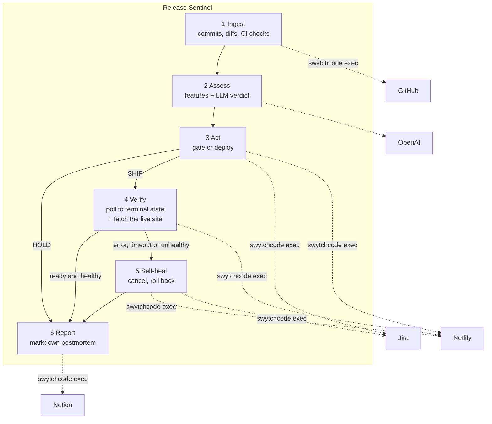
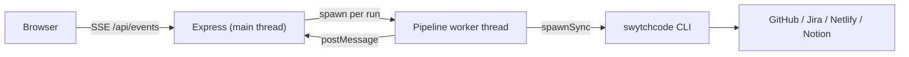

# Release Sentinel

An autonomous release agent. It reads GitHub activity, scores how risky the change
is, decides whether to ship it, triggers the deploy, verifies the result, and —
when a deploy fails — cancels it, rolls production back to the last good deploy,
files a Jira incident and writes a postmortem to Notion.

Every external action is executed through **Swytchcode**. There is no hand-written
HTTP client and no vendor SDK anywhere in this codebase.

Built for the Build with Swytchcode Buildathon, **Track 3 — AI DevOps & Deployment Agent**.

---

## Why this is an agent, not a webhook

A bot that files a ticket when CI goes red is a cron job with extra steps. Release
Sentinel is a closed loop with a real decision in the middle and real recovery at
the end:

- It **decides**. The LLM returns a structured verdict (`SHIP`, `SHIP_WITH_TICKET`,
  `HOLD`) with a risk score and a written rationale, reasoning over extracted
  evidence rather than raw diffs.
- It **acts** on that decision, and the control flow genuinely diverges: a `HOLD`
  never reaches the deploy step.
- It **verifies** its own work twice over: it polls the deploy to a terminal state,
  then fetches the published page and asserts it actually serves the content it
  should. A green build that ships a broken page does not pass.
- It **recovers** without being asked — cancel, roll back, file the incident, write
  the postmortem.

The agent guards the repository it lives in, so the demo is self-contained.

---

## Architecture



Data flows between stages rather than each stage acting independently: the commit
SHA drives the risk verdict, the verdict decides whether a Jira ticket is filed and
whether a deploy happens, the deploy id drives verification, and the rollback
target plus the incident key both land in the Notion report.

### Process model



`@swytchcode/runtime`'s `exec()` is built on `spawnSync`, which blocks the Node
event loop for the entire duration of the subprocess and its HTTP call. Running the
pipeline on the main thread would freeze the server and stall the SSE stream for
tens of seconds per run, so the dashboard would replay the whole timeline at the end
instead of live. The pipeline therefore runs in a worker thread and streams progress
back over `postMessage`.

### Layout

| Path | Role |
| --- | --- |
| `src/swytch.ts` | The only module that calls Swytchcode. Retry policy, error classification and the per-run audit trail live here. |
| `src/integrations/` | One thin module per service, mapping domain operations to canonical IDs. |
| `src/agent/features.ts` | Deterministic risk feature extraction and the heuristic score. |
| `src/agent/risk.ts` | LLM verdict under a strict JSON schema, reconciled against the heuristic. |
| `src/steps/` | One module per pipeline stage. |
| `src/pipeline.ts` | The state machine wiring the stages together. |
| `src/worker.ts` | Runs one pass off the main thread. |
| `src/server.ts` | HTTP API and SSE fan-out. |
| `public/` | Live dashboard. |
| `site/`, `scripts/build-site.mjs` | The static site Netlify builds, and the build that fails authentically. |

---

## Swytchcode usage

22 methods across 4 integrations are enabled in `tooling.json`. The ones on the hot
path:

| Canonical ID | Used for |
| --- | --- |
| `github.commit.get.1` | List commits on the branch since the lookback window |
| `github.commit.get.2` | Per-commit diff stats and changed files |
| `github.commit.checkRuns.get` | CI check runs for the candidate commit |
| `github.commit.status.get` | Combined commit status |
| `github.commit.pulls.get` | Pull requests associated with a commit |
| `netlify.site.get` | Resolve site name and URL |
| `netlify.build.create` | Trigger a real git-linked production build |
| `netlify.deploy.get` | List deploys, to find the rollback target |
| `netlify.deploy.get.1` | Poll a specific deploy's state |
| `netlify.cancel.create` | Cancel a stalled deploy |
| `netlify.deploy.restore.create` | **Roll production back to the last good deploy** |
| `jira.api.issue.create` | File the review ticket and the incident |
| `jira.api.comment.create` | Annotate an existing issue |
| `jira.api.issueLink.create` | Link the incident to the review ticket |
| `notion.markdown.update` | Append the release or incident report as Markdown |
| `notion.comment.create` | Fallback report path |
| `notion.me.list` | Verify the Notion token during preflight |

### Notes from integrating against the live registry

Three things worth recording, because they shaped the design:

1. **`github.commit.list` is the commit *search* endpoint**, not "list a repo's
   commits". Search is served from an index that lags pushes by seconds to minutes,
   which is unusable when the whole point is reacting to a commit that just landed.
   The direct endpoint is `github.commit.get.1`.
2. **Most of the Notion bundle cannot be enabled.** `notion.page.create`,
   `notion.children.update`, `notion.block.update`, `notion.query.create` and others
   fail on `resolve STRUCTs in RETURNS: struct "api.page.createResponse200" not
   found in STRUCTS`. `notion.markdown.update` does work, and appending Markdown is
   a better fit for release notes than assembling blocks — but the agent can only
   append to a page you create, not create pages itself.
3. **Jira's bundle ships a placeholder base URL** (`https://your-domain.atlassian.net`).
   Swytchcode resolves base URLs from `.swytchcode/integrations/manifest.json`, so
   `npm run preflight` rewrites that one field from `JIRA_BASE_URL`. Jira Cloud also
   needs Basic auth (email + API token) rather than the bearer placeholder, and REST
   v3 requires Atlassian Document Format for text fields — both handled in
   `src/integrations/jira.ts`.

Inputs are strictly type-validated by the kernel, so integers must be passed as JSON
numbers. This is why the agent uses the runtime library rather than shelling out with
string CLI flags.

---

## Setup

Requires Node 20+ and the Swytchcode CLI (`npm i -g swytchcode`, then
`swytchcode login`).

```bash
npm install
cp .env.example .env   # then fill it in
```

Fetch the integrations and enable the methods:

```bash
swytchcode get GitHub && swytchcode get Jira && swytchcode get Netlify && swytchcode get Notion
```

Project names are case-sensitive. Then verify everything:

```bash
npm run preflight
```

Preflight rewrites the Jira endpoint, then makes one real call per service so a bad
token surfaces now rather than mid-demo. It creates a throwaway Jira ticket labelled
`preflight` — delete it afterwards.

### What you need to create

| Service | What | Notes |
| --- | --- | --- |
| GitHub | Fine-grained PAT, read access | On a repo you can push to live |
| Netlify | PAT + a site **linked to that repo** | The agent triggers a real build, so the git link is required |
| Jira | Free Cloud site, project, API token | Note the project key |
| Notion | Internal integration token + a page | Share the page with the integration via **... > Connections** |
| OpenAI | API key | Without it the agent falls back to heuristics and flags the verdict as degraded |

Only Notion's page and Netlify's site need manual clicking; everything else is a
token paste.

---

## Running

```bash
npm start        # dashboard on http://localhost:3000
npm run run:once # one headless pass, non-zero exit if the release was not healthy
npm run selftest # drive every branch of the state machine against a stubbed kernel
npm run typecheck
```

`npm run selftest` matters more than it looks. You cannot rehearse a rollback on
demand against a live site without deliberately breaking production, so the branch
that matters most would otherwise be the least tested. It scripts a deploy failure
and asserts the agent cancels, restores the previous deploy and files the incident —
in both flavours: a build that fails, and a build that succeeds while publishing a
broken page. It also covers gating by failing check, gating by threshold, the
ship-with-ticket middle path, and the clean ship:

```
PASS low-risk change ships and is reported
PASS failing CI check is gated before any deploy
PASS failed deploy triggers rollback and an incident
PASS healthy deploy state but a broken page triggers rollback
PASS risky dependency bump ships with a follow-up review ticket
PASS the same change is blocked once the risk threshold is tightened
```

The dashboard streams the agent loop live: each stage's status, the risk gauge and
rationale, the ingested commits, links to every artifact the agent created, and a
table of every `swytchcode exec` with its duration and retry count.

Set `AGENT_DRY_RUN=true` to reason and report without deploying — worth doing once
before pointing it at anything you care about.

---

## Demo script

**Healthy path.** Push a small, safe commit. Sentinel ingests it, scores it low,
ships it, watches the deploy reach `ready`, fetches the published page and confirms
it still serves the marker, then appends a release report to Notion.

**Recovery path — broken page (the one worth demoing).** A build can exit zero and
still publish something broken, and that is the failure a deploy-state poll can
never see. Push a commit whose only change is this one line in `site/index.html`:

```diff
-      <h1>Guarded by Release Sentinel</h1>
+      <h1>TODO: new headline</h1>
```

`scripts/build-site.mjs` succeeds — nothing is missing, the HTML is valid — so
Netlify publishes the deploy and reports `ready`. Then Sentinel fetches the live
URL, does not find `HEALTH_CHECK_MARKER` in the page, retries, gives up, and treats
the release as failed: it restores the last good deploy, files a Jira incident that
says the page was published without the expected content, and writes the postmortem.
The audience watches production break and un-break itself.

Undo it with `git checkout site/index.html` (or push the revert) once the rollback
has been shown. If you legitimately reword that heading, change
`HEALTH_CHECK_MARKER` in `.env` to match.

**Recovery path — broken build.** Still supported: push a commit that renames
`site/site.css` without updating `index.html`. `scripts/build-site.mjs` exits
non-zero, Netlify reports the deploy as `error`, and Sentinel cancels it, restores
the previous deploy, files the incident and reports. Note that Netlify never
publishes this build, so production never visibly changes — which is exactly why
the health check above makes the better demo.

**Gating path.** To show the gate without touching CI, lower `RISK_THRESHOLD` or push
a commit touching `package.json` with `hotfix` in the message. The verdict comes back
`HOLD`, a blocking ticket is filed, and the deploy step never runs.

Rehearse the failure path before demoing it, and force the failure with a change you
have already tested rather than improvising one on stage.

---

## Design decisions

**Deterministic features, LLM judgement.** Feeding raw diffs to a model is expensive
and irreproducible. `features.ts` extracts evidence (churn, whether dependency
manifests or CI config or migrations were touched, failing check counts, urgency
keywords) and the model reasons over that. It keeps token usage bounded and gives the
heuristic fallback the same inputs.

**The model cannot overrule hard evidence.** A verdict is reconciled against the
heuristic score: a failing CI check forces `HOLD` regardless of what the model said,
and the heuristic acts as a floor on the score. A confidently wrong `SHIP` cannot
reach production.

**Degrade rather than abort.** Reads retry only when the kernel marks the failure
retryable; writes never retry, because a duplicate Jira ticket is worse than a failed
one. A missing Notion token costs the report, not the rollback.

**A timeout is a failure.** An unfinished deploy is not a safe state to leave
production in, so it triggers recovery rather than an indefinite wait.

**A green build is not a healthy release.** A deploy state only reports the build's
exit code. The agent fetches the published page and requires a 2xx response
containing a known marker before it calls a release good; a page that publishes
without its content rolls back on the same path as a build failure. That is the
class of failure real deploys actually have.

---

## Limitations

- Runs are triggered manually or on a poll; there is no GitHub webhook receiver, so
  detection is bounded by when a run starts.
- Run history is in memory. The durable artifacts are the Jira issues, Netlify
  deploys and the Notion page, so a restart loses only the dashboard timeline.
- The health check reads the served HTML; it does not run JavaScript, so a page
  that is only broken after hydration still passes. The marker therefore has to be
  content the server sends.
- The agent appends to one Notion page rather than creating a page per release,
  because of the bundle defect described above.
- Rollback assumes a previous successful deploy exists. On a brand-new site there is
  nothing to restore, and the incident says so explicitly.
